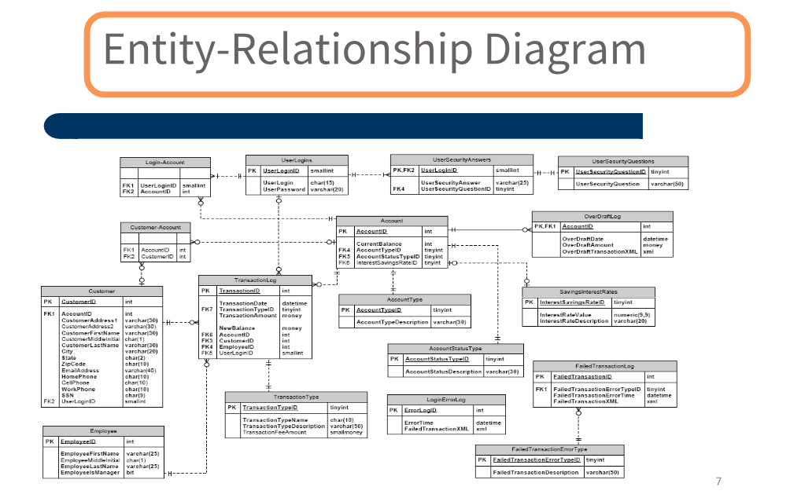
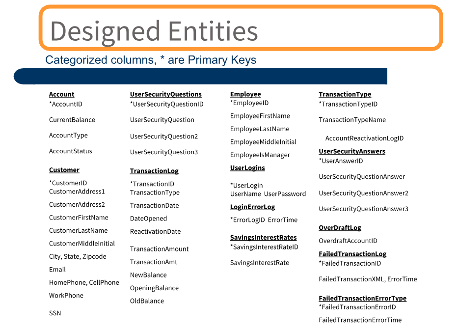

# Bank-Database-Design

### ER Diagram:

### Design Entities:

The Bank Management System application, developed using SQL, is designed to streamline various banking operations efficiently. This system enables banks to manage and track essential customer information, account details, and transactions with ease. The core features include account management, transaction processing, and report generation, ensuring a smooth banking experience for both customers and administrators.

The system supports multiple account types such as savings, current, and fixed deposit accounts. Customers can create new accounts, update their details, and close accounts through the application. Additionally, the system tracks account balances, ensuring accurate updates with every deposit or withdrawal. SQL queries are used to fetch and update data, providing real-time account status and transaction history to users.

Transaction management is a key feature of this system. It records all deposits, withdrawals, and fund transfers, maintaining a detailed log of each transaction. The system ensures data integrity, preventing unauthorized access or errors during financial operations. Customers can easily check their transaction history, balance, and perform secure online transfers between accounts.

The application also supports an administrative module, allowing bank staff to generate reports on customer activity, account status, and transaction summaries. Administrators can monitor account performance and detect any unusual activities by using SQL queries for custom reports.

Overall, the Bank Management System built with SQL enhances the accuracy, efficiency, and security of banking operations, ensuring a user-friendly experience for customers and administrators alike.

